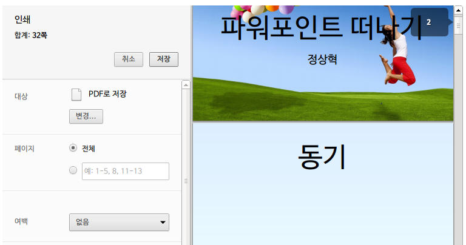

# 동기

--

## 파워포인트로는..
- 우분투에서 작업하기가 어렵다
  - LibreOffice, KingOffice의 한계
    - 호환성이 완벽하지 않다
    - 사용성이 PowerPoint에 뭇 미친다
- 공통 작업이 어렵다
  - 두 명이 동시에 파일을 고치면 합칠 때 괴롭다
- 문서간의 붙여넣기가 깔끔하게 안 된다.
  - 마스터슬라이더를 써도 한계가 있다

--

## 발표문서도 코딩하고  싶다
- 텍스트 기반
- 버전관리
  - Diff, Pull request
- One-source, Multi-format
  - HTML, PDF

---

# 대안을 찾기

--

## Docbook slide

    <slides>
        <slidesinfo>
        <title>Presentation Title</title>
    </slidesinfo>
        <foil>
            <title>Foil Title</title>
            <para>Foil content</para>
        </foil>
    </slides>

- Demo : <http://docbook.sourceforge.net/release/slides-demo/>
- XSLT, FOP를 이용한 HTML, PDF 변환
  - 결과를 보려면 빌드를 해야 함
  - 커스터마이징이 쉽지 않다

--

## Html5 템플릿
- Goole
  - <http://code.google.com/p/html5slides/>
  - <https://code.google.com/p/io-2012-slides/>
  - markdown을 HTML로 변환하는 스크립트 제공
- Mozilla : <https://github.com/codepo8/mozilla-presentation-templates>
- <http://slides.html5rocks.com>
- 나만의 위한 템플릿은 이를 참고로 따로 만들어야함.

--

## 프리젠테이션 프레임워크
- reveal.js : <http://lab.hakim.se/reveal-js/>
- impress.js : <http://bartaz.github.io/impress.js>
- deck.js : <https://github.com/imakewebthings/deck.js>
- shower : <https://github.com/shower/shower>
- 빌드 없이 바로 브라우져에서 결과 확인
- 전환효과, 화면크기, 테마 등 추상화된 커스터마이징 지점

--

## 서비스형
- 공유전용 서비스 : 파일업로드만 가능
  - <http://www.slideshare.net>
  - <https://speakerdeck.com>
- 편집형
  - Google Docs
  - <http://prezi.com/>
  - <http://slides.com/> : reveal.js 기반
  - <https://swipe.to/>
- 내부 자료를 올리면 보안담당자에게 혼날것 같다

--

## 결론
- 프리젠테이션 프레임워크!
  - 빌드 없이 바로 볼 수 있다
  - 유연한 커스터마이징 기능
  - HTML + Javascript 공부도 된다

---

# 프레임워크 고르기

--

## reveal.js

    

        

            <section>프레임워크 고르기</section>
            <section>
                <section>reveal.js</section>
                <section>implress.js</section>
            </section>
        

    

- Demo : <http://lab.hakim.se/reveal-js>

--

- Slide, Subslide 개념
	- 이 발표자료처럼
- Markdown 사용 가능
	- 외부의 md파일로 읽을 수 있음.
- Code syntax highlighting
- 발표자를 위한 기능
	- Multiplexing : 노트북-스마트폰에 나온 화면을 동기화
    	- socket.io을 이용한 구현
	- 발표자 노트
- 수식 지원, Leal motion 등 그외 다양한 기능

--

## impress.js

    

            
프레임워크 고르기

	

- Demo : <http://bartaz.github.io/impress.js/#/bored>
- Prezi와 비슷한 역동적인 슬라이드를 만들 수 있다

--

## deck.js

    <section class="slide">
      <h2>프레임워크 고르기</h2>
    	<ul>
            <li>reveal.js</li>
            <li>impress.js</li>
            <li>deck.js</li>
    	</ul>
    </section>

- Demo : <http://imakewebthings.com/deck.js/>
- 전체 슬라이드를 보여주는 기능이 눈에 확 들어옴
- Reveal.js와 유사하나 덜 풍부한 기능

--

## shower

		<section class="slide">

            <h2>프레임워크 고르기</h2>
            <ul>
                <li>reveal.js</li>
                <li>impress.js</li>
                <li>deck.js</li>
            </ul>
		
</section>

- Demo : <http://shwr.me/>
- 역시나 Reveal.js와 유사하나 덜 풍부한 기능

--

## 결론
- Reveals.js가 내가 쓰려는 용도에 맞다
    - 배치가 단순한 목록 위주의 장표에는 충분
	- Markdown 지원
	- 발표자 노트 등 풍부한 부가 기능
- impress.js도 나중에 배워보자

---

# 활용기

바로 이 발표자료를 만들면서 썼던 기법

--

## 프레임워크 자원 읽기
프로젝트를 복사하기 귀찮다면 데모페이지의 자원을 읽도록 선언할수도 있음

	<link rel="stylesheet" href="http://lab.hakim.se/reveal-js/css/reveal.min.css">

- 되도록 작성하는 문서의 하위폴더에 복사하는 것이 바람직
    -  데모페이지에는 master branch가 아닌 dev branch 소스가 배포되어 있음
    	- 이를 참조할 때 하위호환성을 깨는 수정이 올라가면 내 문서가 깨어진다
	-  Local PC에서 로딩속도 향상

--

## 크기 선언

	Reveal.initialize({
        width: 1200,
        height: 800,
    ...
	});

--

## 표지

	<section data-background="jump-1920.jpg" background-transition="slide" class="center"  >
		<h1>파워포인트 떠나기</h1>
        <h3>정상혁</h3>
	</section>

- 슬라이드별로 배경, 전환효과, 중앙정렬 여부 지정 가능

--

## 외부 마크다운 파일 읽기

	<section data-markdown="slides.md" data-separator="^\n---\n$" data-separator-vertical="^\n--\n$"/>

- 구분자 지정 예
	- 슬라이드 사이는 "---"
	- 서브 슬라이브 사이는 "--"
- dev 브랜치에서는 'data-separator-vertical' 이름을 쓴다
	- 2014년 7월 4일 시점 기준
	- 2.7.3 까지는 'data-vertical'이라는 속성명 이용
	- [속성명 변경 commit](https://github.com/hakimel/reveal.js/commit/015468c3a2d1d4092f33920ac555a0e288e6213f)

--

- 마크다운 소스

        - Reveals.js가 내가 쓰려는 용도에 맞다
            - 배치가 단순한 목록 위주의 장표에는 충분
            - Markdown 지원
            - 발표자 노트 등 풍부한 부가 기능
        - impress.js도 나중에 배워보자

- 외부 마크다운파일 참조는 웹서버를 띄운 상태에서만 가능

--

## 웹서버 실행하기

### Python
명령행에서

	python -m SimpleHTTPServer 8000

Python 소스 안에서

	import SimpleHTTPServer

	SimpleHTTPServer.test(HandlerClass=SimpleHTTPServer.SimpleHTTPRequestHandler)

--

### Ruby
명령행에서

	ruby -run -e httpd . -p8000

--

### Java - Gradle
build.gradle

    apply plugin: 'jetty'
    jettyRun {
        webAppSourceDirectory = file(".")
        contextPath = ""
    }

build.gradle이 위치한 디렉토리의 명령행에서

	gradle jettyRun

- 대부분의 장비에서 별도의 프로그램 설치 없이 바로 실행 가능 
	- Gradle Wrapper파일까지 공유하면 Gradle설치도 필요없다
	- Jetty는 자동으로 다운로드 해 준다
	- 윈도우즈 PC라도 Java는 거의 깔려있다

--

## 웹브라우저 자동 실행
명령행에서

	python -m webbrowser -t "http://localhost:8000"

Python 소스 안에서

	import webbrowser
	webbrowser.open("http://localhost:8000/")

--

### PDF export
- 주소끝에 '?print-pdf'를 붙여서 연다
- 크롬의 인쇄 옵션에서
    - 대상 : PDF로 저장
    - 레이아웃 : 가로 방향
    - 여백 : 없음

--

## Github Pages로 발행
- gh-pages 브랜치에 push하면 'http://.[계정명].github.io/[저장소명]' 으로 접근 가능
	- <http://benelog.github.io/docs/>
- gh-pages 브랜치 생성
	- [프로젝트 페이지 만들기](https://help.github.com/articles/creating-project-pages-manually) 참조
- 발행할 폴더만 gh-pages에 복사, 'git add', 'git commit', 'git push' 
- Gradle github-pages plugin을 명령어 한번으로 끝!
	- <https://github.com/ajoberstar/gradle-git>

--

- build.gradle에 선언

        buildscript {
          repositories {
              jcenter()
          }
          dependencies {
            classpath 'org.ajoberstar:gradle-git:0.6.3'
          }
        }
        apply plugin: 'github-pages'
        githubPages {
          repoUri = 'git@github.com:benelog/docs.git'
          pages {
             from(file('content')) {
                into '.'
             }
          }
        }

- 명령행에서 

		gradle publishGhPages

--

## 소감
- 만족스러운 내용 편집 과정
	- 본문은 Markdown으로 작성해서 내용에 집중할 수 있었다
	- 슬라이드 내용을 재배치 할때 깔끔한 Copy & Paste
	- 슬라이드를 나눌 때도 "---"등의 구분자를 넣는 작업으로 끝
- 효율성을 높이기 위해 고민이 계속 필요하다
	- HTML + Markdown down의 적절한 역할분담
		- 배경 이미지, 정렬 기준이 다른 페이지가 중간에 들어갈 경우 Markdown만으로 해결하기에는 어렵다
- 나만의 테마 CSS를 만들어야겠다
	- 한글 폰트까지 신경을 써서
	- 기존의 회사 문서 템플릿과 유사한 테마 등

--

## 자료
- 이 발표 자료 예제 : <http://github.com/benelog/docs>
	- [슬라이드 내용 Markdown 파일](https://github.com/benelog/docs/blob/master/content/goodbye-powerpoint/slides.md)
	- [Gradle 스크립트](https://github.com/benelog/docs/blob/master/build.gradle)
	- [Python로 서버 실행 + 웹브라우저 열기](https://github.com/benelog/docs/blob/master/start-py.sh)
- Reveal.js 강의
	- 생활코딩의 <http://opentutorials.org/module/390/4016>
	- <http://htmlcheats.com/reveal-js/reveal-js-tutorial-reveal-js-for-beginners/>
    - <http://www.sitepoint.com/creating-slick-html-presentations-using-reveal-js/>

